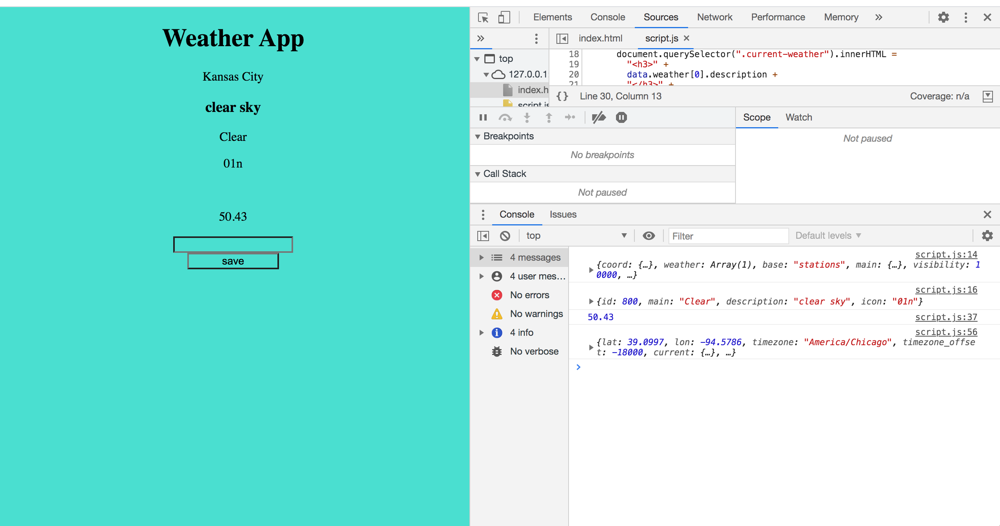

# homework-6

Weather App

What was your motivation?

To put some of my skills to the test.

Why did you build this project?
This homework assignment help me get familiar with API and some of the things we learn in the Previous weeks.

What problem does it solve?
How API works
What did you learn?
A better understanding of a functioning weather app.

[Link to deployable application](https://jose8160.github.io/homework-6/)

